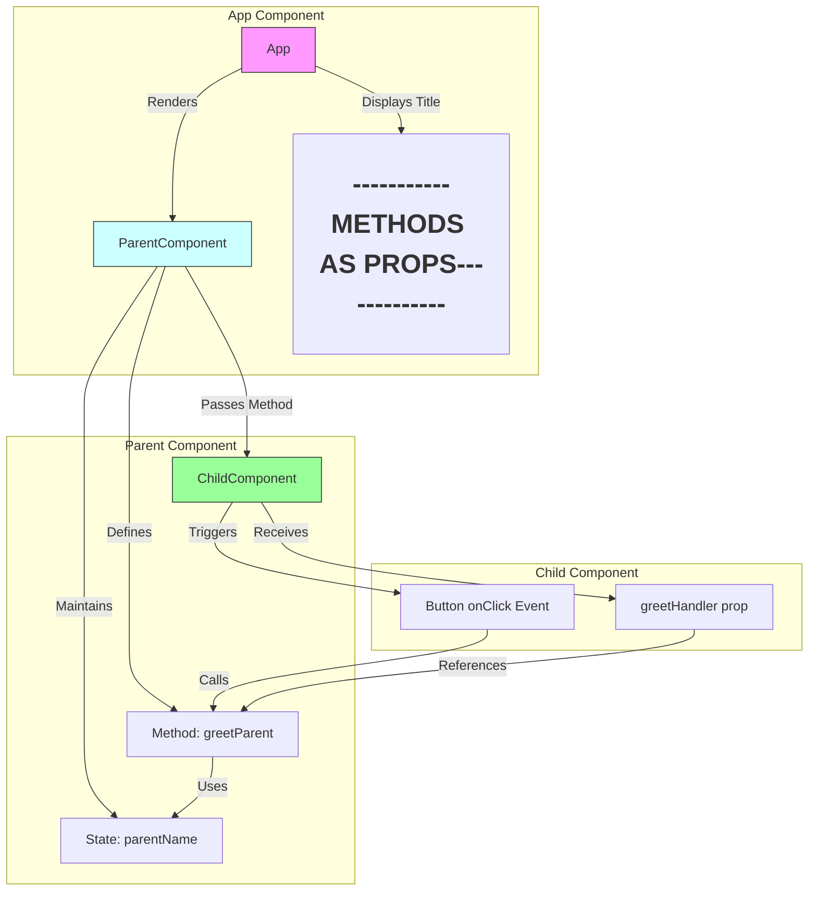

An architecture diagram and flow explanation for passing methods as props in ReactJS based on the code:



### Data Flow:
1. **App Component**
   - Root component
   - Renders ParentComponent
   - Contains static title display

2. **ParentComponent**
   - Maintains state with `parentName`
   - Defines `greetParent()` method
   - Passes method to child via `greetHandler` prop
   ```jsx
   <ChildComponent greetHandler={this.greetParent}/>
   ```

3. **ChildComponent**
   - Receives method as prop
   - Triggers parent method through event
   ```jsx
   <button onClick={() => props.greetHandler()}>
   ```

### Key Characteristics:
1. **Unidirectional Data Flow**:
   - Parent → Child communication only
   - Data flows down through props

2. **Method Binding**:
   - Parent component binds method in constructor
   ```jsx
   this.greetParent = this.greetParent.bind(this)
   ```

3. **Event Handling**:
   - Child component triggers parent method via prop
   - Uses arrow function to maintain context

4. **Component Hierarchy**:
   ```
   App
   └── ParentComponent
       └── ChildComponent
   ```

### Sequence Diagram:
```
┌──────┐         ┌─────────────┐         ┌────────────┐
│ App  │         │ Parent      │         │ Child      │
└──┬───┘         └──────┬──────┘         └─────┬──────┘
   │     Render Parent  │                      │
   │ ──────────────────>│                      │
   │                    │  Pass greetHandler   │
   │                    │ ────────────────────>│
   │                    │                      │  User clicks
   │                    │                      │ ────┐
   │                    │      Call handler    │ <───┘
   │                    │<─────────────────────│
   │  [Alert Displayed] │                      │
   │ <──────────────────│                      │
┌──┴───┐         ┌──────┴──────┐         ┌─────┴──────┐
│ App  │         │ Parent      │         │ Child      │
└──────┘         └─────────────┘         └────────────┘
```

This pattern enables:
- State management in parent components
- Reusable presentational child components
- Clear separation of concerns
- Easy testing of component interactions

Remember this is a fundamental React pattern used for:
- Lifting state up
- Creating controlled components
- Implementing callback patterns
- Managing cross-component communication