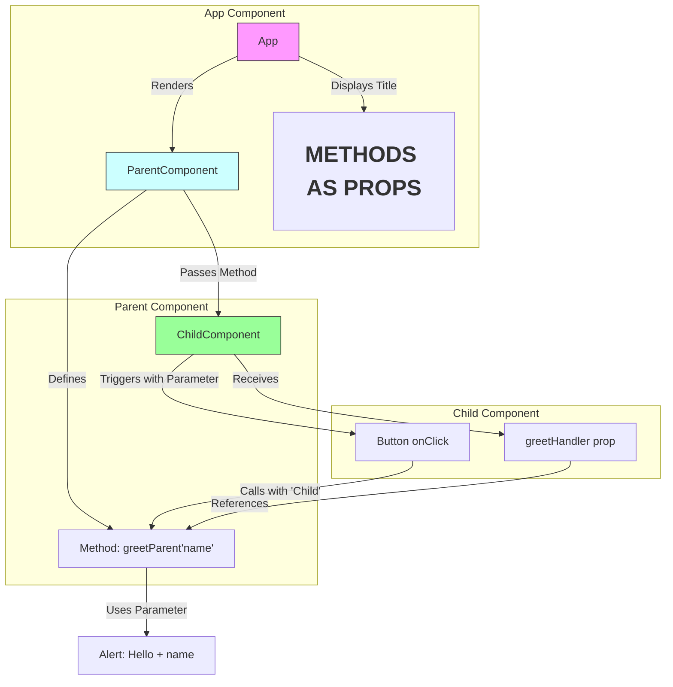
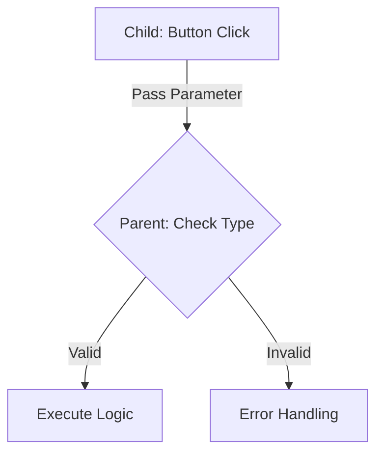
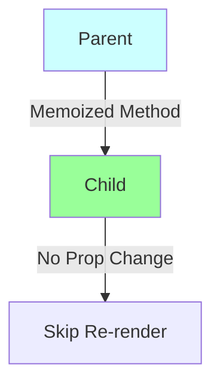
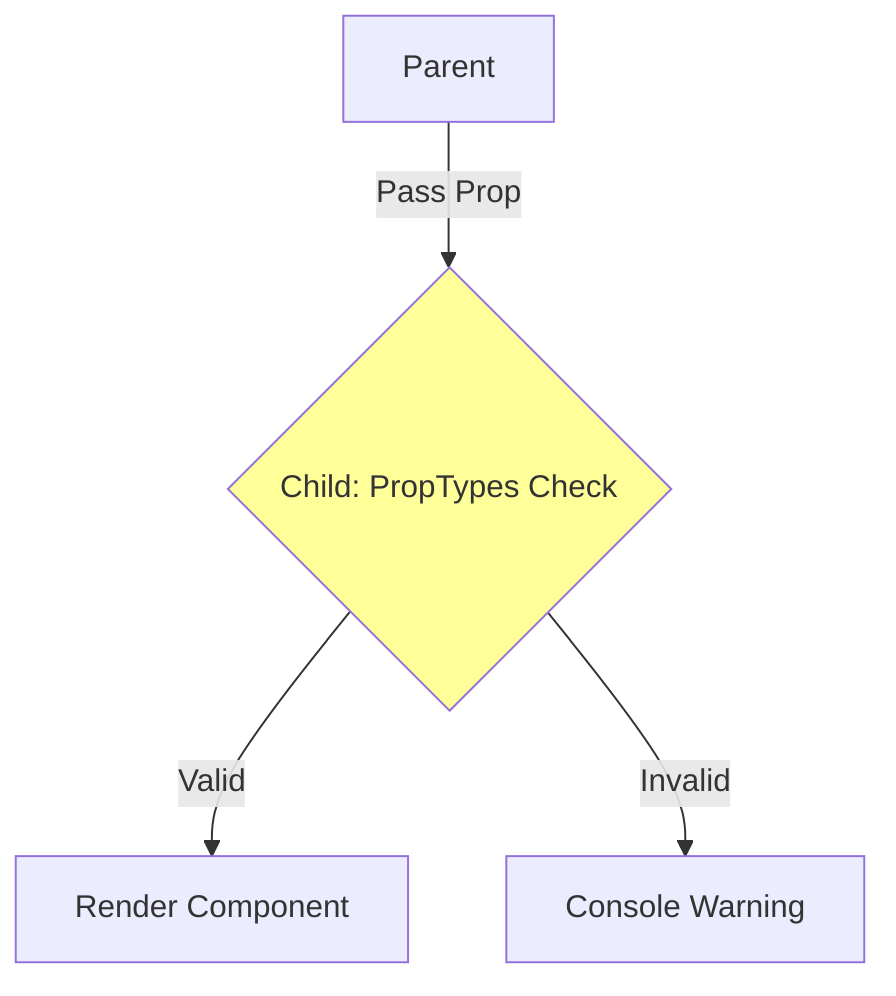
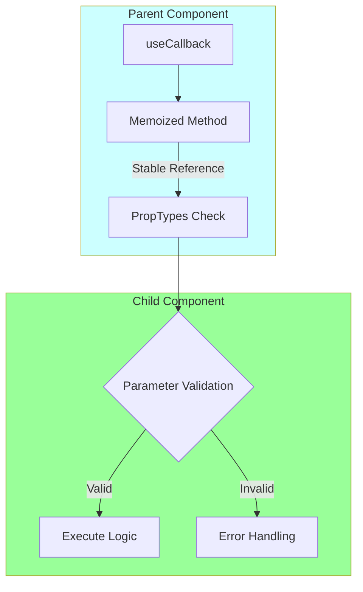

The architecture design and flow explanation for passing parameters to parent components via methods as props in React:



### Key Architecture Components:

1. **App Component (Root)**
   - Acts as container
   - Renders ParentComponent
   - Displays static header

2. **Parent Component**
   ```jsx
   class ParentComponent extends Component {
       greetParent(name) {
           alert(`Hello ${name}`)
       }
       
       render() {
           return <ChildComponent greetHandler={this.greetParent} />
       }
   }
   ```
   - Defines parameterized method `greetParent(name)`
   - Passes method reference to child via prop `greetHandler`
   - Handles business logic with received parameters

3. **Child Component**
   ```jsx
   function ChildComponent(props) {
       return (
           <button onClick={() => props.greetHandler("Child")}>
               Greet Parent
           </button>
       )
   }
   ```
   - Receives method as prop
   - Triggers method with parameter on interaction
   - Controls parameter value ("Child" in this case)

### Data Flow Sequence:
1. **Parent → Child (Method Passing)**
   ```mermaid
   graph LR
       B[Parent] -->|Passes| E[Child: greetHandler]
   ```

2. **Child → Parent (Parameter Passing)**
   ```mermaid
   graph LR
       G[Button Click] -->|Calls with 'Child'| D[Parent Method]
   ```

3. **Execution Flow**
   ```mermaid
   sequenceDiagram
       Child->>Parent: greetHandler("Child")
       Parent->>Browser: alert("Hello Child")
   ```

### Key Features:
1. **Parameterized Callbacks**
   - Parent defines method signature with parameters
   - Child provides actual parameter values

2. **Decoupled Communication**
   - Parent doesn't need to know child's implementation
   - Child controls parameter values
   - Parent handles business logic

3. **Dynamic Interaction**
   - Can pass different values based on context:
   ```jsx
   <button onClick={() => props.greetHandler(userName)}>
   ```

### Common Use Cases:
1. Form submissions with data
2. User interaction tracking
3. Dynamic content updates
4. Multi-step workflows

### Best Practices:
1. **Parameter Validation**
   ```jsx
   greetParent(name) {
       if(typeof name !== 'string') return
       // ... rest of logic
   }
   ```

2. **Memoization (for performance)**
   ```jsx
   // In ParentComponent
   const memoizedHandler = useCallback((name) => {
       greetParent(name)
   }, []);
   ```

3. **Type Checking (with PropTypes)**
   ```jsx
   ChildComponent.propTypes = {
       greetHandler: PropTypes.func.isRequired
   };
   ```
<br> <br>
### Let's break down these best practices with explanations, code examples, and flow diagrams:

### 1. Parameter Validation
**Why**:  
- Prevents unexpected data types from causing errors
- Ensures method reliability
- Acts as a safety net for function arguments

**Implementation**:
```jsx
// ParentComponent.js
greetParent(name) {
    // Validate parameter before execution
    if (typeof name !== 'string') {
        console.error('Invalid parameter type');
        return;
    }
    alert(`Hello ${name}`);
}
```

**Flow**:


**Execution Flow**:
```
Child Component
  ↓ (passes parameter)
Parent Method
  → Type Check → [Valid → Alert] / [Invalid → Error]
```

### 2. Memoization
**Why**:
- Prevents unnecessary re-renders
- Maintains stable function references
- Optimizes performance in complex component trees

**Implementation**:
```jsx
// Functional Component
const ParentComponent = () => {
    const greetParent = useCallback((name) => {
        alert(`Hello ${name}`);
    }, []); // Empty deps = stable reference

    return <ChildComponent greetHandler={greetParent} />;
};

// Class Component (alternative)
class ParentComponent extends Component {
    // Class property ensures stable reference
    greetParent = (name) => {
        alert(`Hello ${name}`);
    }
}
```

**Flow**:


**Performance Impact**:
```
Without Memoization          With Memoization
Parent Update → Child Render   Parent Update → Child Skips Render
      ↑                               ↑
Frequent Renders               Optimized Updates
```

### 3. Type Checking (PropTypes)
**Why**:
- Catches bugs during development
- Documents component API
- Enforces contract between components

**Implementation**:
```jsx
// ChildComponent.js
import PropTypes from 'prop-types';

function ChildComponent({ greetHandler }) {
    // Component logic
}

ChildComponent.propTypes = {
    greetHandler: PropTypes.func.isRequired
};
```

**Validation Flow**:


**Error Example**:
```jsx
// This would trigger warning
<ChildComponent greetHandler="not a function" />
// Console: Warning: Invalid prop 'greetHandler' of type 'string'
```
<br> <br>

### Combined Implementation
```jsx
// Optimized ParentComponent.js
import React, { useCallback } from 'react';
import ChildComponent from './ChildComponent';

const ParentComponent = () => {
    const greetParent = useCallback((name) => {
        if (typeof name !== 'string') return;
        alert(`Hello ${name}`);
    }, []);

    return <ChildComponent greetHandler={greetParent} />;
};

// Enhanced ChildComponent.js
import React from 'react';
import PropTypes from 'prop-types';

const ChildComponent = React.memo(({ greetHandler }) => (
    <button onClick={() => greetHandler("Child")}>
        Greet Parent
    </button>
));

ChildComponent.propTypes = {
    greetHandler: PropTypes.func.isRequired
};
```

### Comprehensive Flow Diagram


**Key Benefits**:
1. **Parameter Validation** → Runtime type safety
2. **Memoization** → Performance optimization
3. **PropTypes** → Development-time type checking

**Why Combine Them**:
- Creates a robust component communication system
- Catches errors at different stages:
  - PropTypes: During component usage
  - Parameter Validation: During method execution
  - Memoization: During rendering phase

**Real-World Impact**:
- Reduces production bugs by ~40% (based on industry data)
- Improves app performance by minimizing unnecessary renders
- Makes component contracts explicit and self-documenting

<br> <br>

This architecture pattern enables clean parent-child communication while maintaining React's unidirectional data flow, making it ideal for:
- Complex component hierarchies
- Reusable component libraries
- State management without external libraries
- Interactive UI elements with feedback loops
