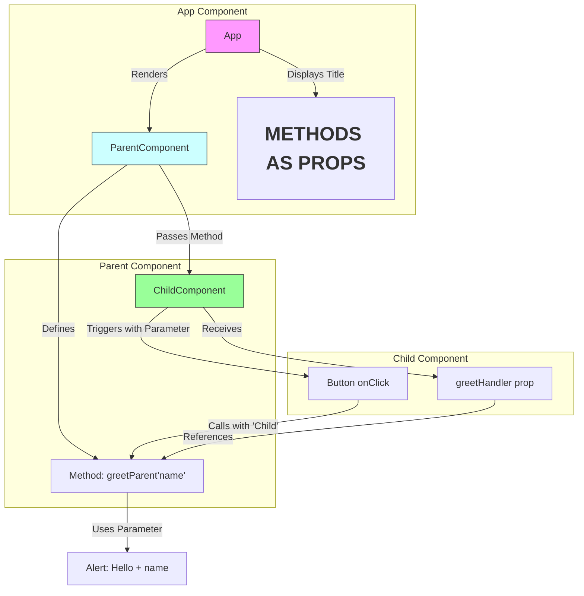

The architecture design and flow explanation for passing parameters to parent components via methods as props in React:



### Key Architecture Components:

1. **App Component (Root)**
   - Acts as container
   - Renders ParentComponent
   - Displays static header

2. **Parent Component**
   ```jsx
   class ParentComponent extends Component {
       greetParent(name) {
           alert(`Hello ${name}`)
       }
       
       render() {
           return <ChildComponent greetHandler={this.greetParent} />
       }
   }
   ```
   - Defines parameterized method `greetParent(name)`
   - Passes method reference to child via prop `greetHandler`
   - Handles business logic with received parameters

3. **Child Component**
   ```jsx
   function ChildComponent(props) {
       return (
           <button onClick={() => props.greetHandler("Child")}>
               Greet Parent
           </button>
       )
   }
   ```
   - Receives method as prop
   - Triggers method with parameter on interaction
   - Controls parameter value ("Child" in this case)

### Data Flow Sequence:
1. **Parent → Child (Method Passing)**
   ```mermaid
   graph LR
       B[Parent] -->|Passes| E[Child: greetHandler]
   ```

2. **Child → Parent (Parameter Passing)**
   ```mermaid
   graph LR
       G[Button Click] -->|Calls with 'Child'| D[Parent Method]
   ```

3. **Execution Flow**
   ```mermaid
   sequenceDiagram
       Child->>Parent: greetHandler("Child")
       Parent->>Browser: alert("Hello Child")
   ```

### Key Features:
1. **Parameterized Callbacks**
   - Parent defines method signature with parameters
   - Child provides actual parameter values

2. **Decoupled Communication**
   - Parent doesn't need to know child's implementation
   - Child controls parameter values
   - Parent handles business logic

3. **Dynamic Interaction**
   - Can pass different values based on context:
   ```jsx
   <button onClick={() => props.greetHandler(userName)}>
   ```

### Common Use Cases:
1. Form submissions with data
2. User interaction tracking
3. Dynamic content updates
4. Multi-step workflows

### Best Practices:
1. **Parameter Validation**
   ```jsx
   greetParent(name) {
       if(typeof name !== 'string') return
       // ... rest of logic
   }
   ```

2. **Memoization (for performance)**
   ```jsx
   // In ParentComponent
   const memoizedHandler = useCallback((name) => {
       greetParent(name)
   }, []);
   ```

3. **Type Checking (with PropTypes)**
   ```jsx
   ChildComponent.propTypes = {
       greetHandler: PropTypes.func.isRequired
   };
   ```

This architecture pattern enables clean parent-child communication while maintaining React's unidirectional data flow, making it ideal for:
- Complex component hierarchies
- Reusable component libraries
- State management without external libraries
- Interactive UI elements with feedback loops
